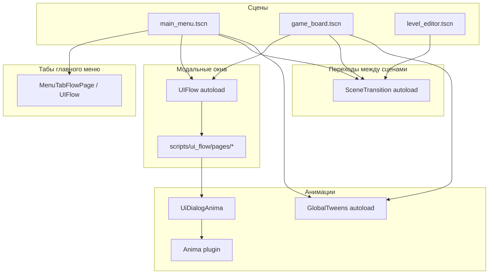

# UI-фреймворк Elemental Blast

Справочник по UI-плагинам и обёрткам проекта: где что подключено, как вызывать, как добавлять новые экраны.  
Предназначен для разработчиков и нейросетей — даёт карту файлов и паттернов без чтения всего репозитория.

**Godot:** 4.6 · **Viewport:** 648×1200 (portrait)

---

## Содержание

1. [Архитектура](#архитектура)
2. [Autoload и плагины](#autoload-и-плагины)
3. [SceneTransition — смена сцен](#scenetransition--смена-сцен)
4. [UIFlow — табы главного меню](#uiflow--табы-главного-меню)
5. [Anima + UiDialogAnima — анимации диалогов](#anima--uidialoganima--анимации-диалогов)
6. [GlobalTweens — игровой фидбек](#globaltweens--игровой-фидбек)
7. [UIFlow — стек модальных страниц](#uiflow--стек-модальных-страниц)
8. [UIFlowUI.Toast — тосты](#uiflowuitoast--тосты)
9. [GUT — автотесты](#gut--автотесты)
10. [Карта файлов](#карта-файлов)
11. [Как добавить новый модальный экран](#как-добавить-новый-модальный-экран)
12. [Что намеренно не на UIFlow](#что-намеренно-не-на-uiflow)
13. [Известные ограничения](#известные-ограничения)

---

## Архитектура

Три слоя UI-анимаций и навигации:



| Слой | Инструмент | Когда использовать |
|------|------------|-------------------|
| Сцена ↔ сцена | `SceneTransition` | Меню → бой, бой → меню, редактор |
| Таб ↔ таб | `UIFlow` + `MenuTabFlowPage` | Shop / Main / Ranks в главном меню |
| Модальный стек | `UIFlow` | Диалоги поверх текущей сцены |
| Открытие диалога | `UiDialogAnima` + Anima | Dimmer, panel pop-in, кнопки |
| Геймплейный фидбек | `GlobalTweens` | Shake, color_flash на поле и HUD |

---

## Autoload и плагины

Регистрация в [`project.godot`](../project.godot) (`[autoload]`, `[editor_plugins]`):

| Autoload | Путь | Назначение |
|----------|------|------------|
| `SceneTransition` | [`scripts/scene_transition.gd`](../scripts/scene_transition.gd) | Fade между сценами |
| `GlobalTweens` | [`addons/global_tweens/GlobalTweens.gd`](../addons/global_tweens/GlobalTweens.gd) | Универсальные твины |
| `UIFlow` | [`addons/ui_flow/core/ui_flow_autoload.tscn`](../addons/ui_flow/core/ui_flow_autoload.tscn) | Стек UI-страниц |
| `UIFlowUI` | [`addons/ui_flow/core/ui_flow_ui_autoload.tscn`](../addons/ui_flow/core/ui_flow_ui_autoload.tscn) | Toast, confirm и пр. |

| Плагин (editor) | Путь | Лицензия |
|-----------------|------|----------|
| Anima 0.6 | [`addons/anima/`](../addons/anima/) | MIT |
| GUT 9.6.1 | [`addons/gut/`](../addons/gut/) | MIT |
| UIFlow | [`addons/ui_flow/`](../addons/ui_flow/) | (см. README плагина) |
| Simple GUI Transitions 0.5.0 | [`addons/simple-gui-transitions/`](../addons/simple-gui-transitions/) | MIT (в проекте не используется, оставлен в addons) |

Документация upstream UIFlow: [`addons/ui_flow/README.md`](../addons/ui_flow/README.md), [`addons/ui_flow/docs/getting_started.md`](../addons/ui_flow/docs/getting_started.md).

---

## SceneTransition — смена сцен

**Файл:** [`scripts/scene_transition.gd`](../scripts/scene_transition.gd)

Чёрный `ColorRect` на `CanvasLayer` (layer 140): fade out → `change_scene_to_file` → fade in.

### API

```gdscript
var err := await SceneTransition.change_scene_to("res://scenes/game_board.tscn")
# err == OK | ERR_BUSY | другой код загрузки
SceneTransition.is_busy() -> bool
```

### Длительность fade

| Режим | Длительность |
|-------|--------------|
| Обычный | 0.4 с |
| Web smoke (`?smoke_test=1`) | 0.05 с |
| Headless (GUT) | 0.01 с |

### Где используется

| Сцена / скрипт | Переход | Строки (ориентир) |
|----------------|---------|-------------------|
| [`scripts/main_menu.gd`](../scripts/main_menu.gd) | Меню → `game_board.tscn` | `_start_gameplay_from_level_dialog` |
| [`scripts/game_board.gd`](../scripts/game_board.gd) | Бой → `main_menu.tscn` | победа, поражение, ручной выход, ошибка загрузки |
| [`scripts/level_editor.gd`](../scripts/level_editor.gd) | Редактор ↔ меню / тест боя | BackButton, Test Level |

### Тесты

[`tests/gut/test_scene_transition.gd`](../tests/gut/test_scene_transition.gd) — autoload, невалидный путь, `ERR_BUSY`.

---

## UIFlow — табы главного меню

**Страница:** [`scripts/ui_flow/pages/menu_tab_flow_page.gd`](../scripts/ui_flow/pages/menu_tab_flow_page.gd) (`class_name MenuTabFlowPage`)

Табы Shop / Main / Ranks больше не переключаются через GuiTransitions. Контент остаётся в [`scenes/main_menu.tscn`](../scenes/main_menu.tscn) (`TabContent/*`), а UIFlow держит на стеке одну базовую страницу `MenuTabFlowPage`.

### Поведение

| Аспект | Реализация |
|--------|------------|
| Старт | `call_deferred("_push_menu_tab_page", "main", true)` в `_setup_menu_tab_flow()` |
| Смена таба | `UIFlow.close(MenuTabFlowPage)` → `push_instance` новой страницы |
| Анимация | Fade-in `tab_root.modulate.a` (0.35 с), без reparent узлов |
| Глубина стека | Базовый таб = **1**; модалки (LevelStart, GoldenPass) = **2** |
| Блокировка табов | `_tab_switch_busy`, `_is_modal_uiflow_open()` (`stack_depth() > 1`) |

```gdscript
# scripts/main_menu.gd
func _switch_tab(tab_name: String) -> void:
    if tab_name == _current_tab_name or _tab_switch_busy or _is_modal_uiflow_open():
        return
    _tab_switch_busy = true
    _current_tab_name = tab_name
    _push_menu_tab_page(tab_name)
```

### Данные `push_instance`

```gdscript
{
    "tab_id": "shop" | "main" | "ranks",
    "tab_root": Control,           # shop_tab / main_tab / ranks_tab
    "all_tabs": [shop, main, ranks],
    "instant": bool                # true при первом открытии (без fade)
}
```

### Тесты

[`tests/gut/test_dialog_single_open.gd`](../tests/gut/test_dialog_single_open.gd) — `test_main_menu_tabs_use_uiflow`, `test_main_menu_switch_tab_updates_uiflow`.

---

## Anima + UiDialogAnima — анимации диалогов

**Anima** — плагин [`addons/anima/`](../addons/anima/).  
**Обёртка проекта:** [`scripts/ui_dialog_anima.gd`](../scripts/ui_dialog_anima.gd) (`class_name UiDialogAnima`).

Централизует easing и типовые motion для диалогов. Всегда предпочитать `UiDialogAnima`, а не прямые вызовы `Anima` в игровом коде.

### Методы UiDialogAnima

| Метод | Назначение |
|-------|------------|
| `play_dialog_open(dimmer, panel)` | Dimmer fade + panel scale-in |
| `play_panel_enter(panel)` | Только панель |
| `play_pop_in(control)` | Pop-in без dimmer |
| `play_victory_title(title)` | Заголовок победы |
| `play_defeat_title(title)` | Заголовок поражения |
| `play_attention_pulse(target)` | Пульс FAB / кнопки Play |
| `play_button_press / play_button_release` | Нажатие кнопок |
| `play_nav_select(btn)` | Активная вкладка нижней навигации |
| `play_toast_in / play_toast_out` | Fallback-тост (без UIFlowUI) |

### Где используется

| Файл | Анимации |
|------|----------|
| [`scripts/level_start_dialog.gd`](../scripts/level_start_dialog.gd) | `play_dialog_open`, `play_attention_pulse` на Play |
| [`scripts/level_end_dialog.gd`](../scripts/level_end_dialog.gd) | `play_pop_in`, `play_dialog_open`, victory/defeat title |
| [`scripts/main_menu.gd`](../scripts/main_menu.gd) | Кнопки меню, nav select, golden pass FAB pulse |
| [`scripts/LogCopyService.gd`](../scripts/LogCopyService.gd) | Fallback toast через Anima |

**Не на Anima:** покупка бустера в бою (`ingame_booster_purchase_dialog.gd`) — статичная вёрстка; вход/выход через UIFlow fade.

---

## GlobalTweens — игровой фидбек

**Файл:** [`addons/global_tweens/GlobalTweens.gd`](../addons/global_tweens/GlobalTweens.gd)  
Полный API — комментарий-индекс в начале файла (~100+ функций).

### Используется в проекте

| Событие | Файл | Вызов |
|---------|------|-------|
| Потеря жизни | [`scripts/game_board.gd`](../scripts/game_board.gd) | `color_flash` на панели + `shake(self, 6.0, 0.14)` |
| Покупка бустера в бою | [`scripts/game_board.gd`](../scripts/game_board.gd) | `color_flash` на кнопке бустера |
| Смерть босса | [`scripts/game_board.gd`](../scripts/game_board.gd) | `shake(self, 7.0, 0.18)` |
| Победа уровня | [`scripts/game_board.gd`](../scripts/game_board.gd) | `color_flash` на счётчике + `shake(self, 8.0, 0.2)` |
| Спавн из портала | [`scripts/game_board.gd`](../scripts/game_board.gd) | `shake(self, 4.0, 0.1)` |
| Изменение монет в меню | [`scripts/main_menu.gd`](../scripts/main_menu.gd) | `color_flash` на `TopBarCoinsCount` |
| Claim в Golden Pass | [`scripts/golden_pass_dialog.gd`](../scripts/golden_pass_dialog.gd) | `color_flash` на кнопках claim |

### Важно для геймплея

- `game_board` — корень `Node2D`, не `Camera2D`. Для тряски поля используется `GlobalTweens.shake(self)`, не `camera_shake`.
- `camera_shake` требует `Camera2D` — в проекте пока не применяется.
- Анимации фишек/снарядов/смерти врагов — **собственный tick** в `game_board.gd` (`_active_anims`, `_enemy_death_anims`, `_projectiles`), не GlobalTweens.

---

## UIFlow — стек модальных страниц

**Ядро плагина:** [`addons/ui_flow/core/ui_flow_autoload.gd`](../addons/ui_flow/core/ui_flow_autoload.gd)

### Паттерн Elemental Blast

1. В `_ready` сцены создаётся `UIFlowRoot` (`Control`, full rect, высокий `z_index`).
2. `UIFlow.set_ui_root(flow_root)`.
3. Модалка = класс, наследующий [`EbModalFlowPage`](../scripts/ui_flow/eb_modal_flow_page.gd) → `UIFlowPage` с `UIFlowFadeEffect` (0.22 с).
4. Открытие: `UIFlow.push_instance(page, data_dict)`.
5. Закрытие: `UIFlow.pop()` внутри page + сброс флагов в `page_closed`.

### Базовый класс

[`scripts/ui_flow/eb_modal_flow_page.gd`](../scripts/ui_flow/eb_modal_flow_page.gd):

- `is_modal = true`
- `exit_reverses_enter = true`
- `enter_effect = UIFlowFadeEffect` (duration 0.22)
- full-screen, `mouse_filter = STOP`

### Flow pages (игровые обёртки)

| class_name | Файл | Диалог внутри | Данные `push_instance` | Сигналы наружу |
|------------|------|---------------|------------------------|----------------|
| `LevelStartFlowPage` | [`scripts/ui_flow/pages/level_start_flow_page.gd`](../scripts/ui_flow/pages/level_start_flow_page.gd) | [`level_start_dialog.gd`](../scripts/level_start_dialog.gd) | `level: int` (опционально) | `start_gameplay(boosts, bonuses)` |
| `MenuTabFlowPage` | [`scripts/ui_flow/pages/menu_tab_flow_page.gd`](../scripts/ui_flow/pages/menu_tab_flow_page.gd) | `TabContent/*` в сцене | см. ниже | — |
| `GoldenPassFlowPage` | [`scripts/ui_flow/pages/golden_pass_flow_page.gd`](../scripts/ui_flow/pages/golden_pass_flow_page.gd) | [`golden_pass_dialog.gd`](../scripts/golden_pass_dialog.gd) | — | — (только `closed`) |
| `LevelEndFlowPage` | [`scripts/ui_flow/pages/level_end_flow_page.gd`](../scripts/ui_flow/pages/level_end_flow_page.gd) | [`level_end_dialog.gd`](../scripts/level_end_dialog.gd) | см. ниже | `to_menu_pressed`, `refill_lives_pressed` |
| `BoosterPurchaseFlowPage` | [`scripts/ui_flow/pages/booster_purchase_flow_page.gd`](../scripts/ui_flow/pages/booster_purchase_flow_page.gd) | [`ingame_booster_purchase_dialog.gd`](../scripts/ingame_booster_purchase_dialog.gd) | см. ниже | `purchase_pressed`, `closed_pressed` |

#### LevelEndFlowPage — поля `data`

```gdscript
# Победа
{"mode": "victory", "total": int, "base_reward": int, "chips_bonus": int,
 "bonus_chips_count": int, "coins_per_bonus_chip": int}
# Поражение без жизней
{"mode": "defeat_no_lives", "refill_cost": int, "player_coins": int,
 "hearts_to_restore": int, "can_refill": bool}
```

#### MenuTabFlowPage — поля `data`

```gdscript
{"tab_id": "shop"|"main"|"ranks", "tab_root": Control,
 "all_tabs": Array[Control], "instant": bool}
```

#### BoosterPurchaseFlowPage — поля `data`

```gdscript
{"display_name": String, "icon_tex": Texture2D|null, "cost": int,
 "pack_qty": int, "player_coins": int, "can_afford": bool,
 "header_title": String}  # по умолчанию "БУСТЕР ЗАКОНЧИЛСЯ"
```

### Где открывается UIFlow

| Сцена | Файл | Страница | Защита от дубля |
|-------|------|----------|-----------------|
| Главное меню | [`scripts/main_menu.gd`](../scripts/main_menu.gd) | `MenuTabFlowPage` (база), `LevelStartFlowPage`, `GoldenPassFlowPage` | таб: `_tab_switch_busy`; модалки: `_is_modal_uiflow_open()` |
| Бой | [`scripts/game_board.gd`](../scripts/game_board.gd) | `LevelEndFlowPage`, `BoosterPurchaseFlowPage` | `_level_end_flow_open`, `_booster_purchase_flow_open`, `stack_depth()` |

`UIFlowRoot` в бою: z_index **250**, внутри `UIRoot`. В меню: z_index **200**.

Обработчик `UIFlow.page_closed` сбрасывает флаги `_level_*_open` / `_booster_purchase_flow_open`.

---

## UIFlowUI.Toast — тосты

**Файл:** [`addons/ui_flow/core/ui_flow_ui_autoload.gd`](../addons/ui_flow/core/ui_flow_ui_autoload.gd)

| Файл | Использование |
|------|---------------|
| [`scripts/LogCopyService.gd`](../scripts/LogCopyService.gd) | «Скопировано» — `UIFlowUI.Toast.show(msg, "success", 1.6)`, позиция `BOTTOM_RIGHT` |

Если `UIFlowUI.Toast` недоступен — fallback на `UiDialogAnima` + свой `Label`.

---

## GUT — автотесты

**Конфиг:** [`.gutconfig.json`](../.gutconfig.json)  
**Каталог:** [`tests/gut/`](../tests/gut/)  
**Игнор engine-ошибок:** `failure_error_types: ["gut"]` (шрифты в headless).

### Запуск

```bash
# Первый раз или после смены ассетов
godot --headless --import --path .

# Прогон всех тестов (37 тестов)
godot --headless --path . -s addons/gut/gut_cmdln.gd -gexit
```

### Файлы тестов

| Файл | Покрытие |
|------|----------|
| [`test_scene_transition.gd`](../tests/gut/test_scene_transition.gd) | SceneTransition autoload, ошибки, busy |
| [`test_dialog_single_open.gd`](../tests/gut/test_dialog_single_open.gd) | Один диалог за раз, level start + UIFlow stack |
| [`test_level_manager.gd`](../tests/gut/test_level_manager.gd) | LevelManager: монеты, бусты, golden pass, buy_booster |
| [`test_uiflow.gd`](../tests/gut/test_uiflow.gd) | UIFlow autoload, все flow pages |

См. также [`docs/dialog_testing_checklist.md`](dialog_testing_checklist.md).

---

## Карта файлов

```
project.godot                          # autoload, gui_transitions defaults
scripts/
  scene_transition.gd                  # fade между сценами
  ui_dialog_anima.gd                   # обёртка Anima для диалогов
  main_menu.gd                         # UIFlow табы + модалки + Anima + GlobalTweens
  game_board.gd                        # UIFlow (конец уровня, бустеры) + GlobalTweens + SceneTransition
  level_editor.gd                      # SceneTransition
  LogCopyService.gd                    # UIFlowUI.Toast
  level_start_dialog.gd                # UI старта уровня (Anima)
  level_end_dialog.gd                  # UI победы/поражения (Anima)
  golden_pass_dialog.gd                # Golden Pass (GlobalTweens на claim)
  ingame_booster_purchase_dialog.gd    # Покупка бустера (контент для UIFlow)
  ui_flow/
    eb_modal_flow_page.gd              # база flow pages
    pages/
      menu_tab_flow_page.gd
      level_start_flow_page.gd
      golden_pass_flow_page.gd
      level_end_flow_page.gd
      booster_purchase_flow_page.gd
addons/
  anima/                               # плагин Anima
  simple-gui-transitions/              # legacy (не подключён)
  global_tweens/GlobalTweens.gd        # shake, color_flash, ...
  ui_flow/                             # UIFlow + UIFlowUI
  gut/                                 # тестовый фреймворк
tests/gut/                             # GUT-тесты UI и LevelManager
scenes/
  main_menu.tscn                       # TabContent + нижняя навигация
  game_board.tscn                      # UIRoot (UIFlowRoot создаётся в коде)
```

---

## Как добавить новый модальный экран

### 1. Диалог (контент)

Создать `scripts/my_dialog.gd` (`extends Control`):

- `setup(...)` — построение UI
- Сигналы действий (`confirmed`, `closed`, …)
- Анимация открытия через `UiDialogAnima.play_dialog_open` (если нужна Anima поверх UIFlow fade)

### 2. Flow page

```gdscript
# scripts/ui_flow/pages/my_flow_page.gd
class_name MyFlowPage
extends EbModalFlowPage

signal confirmed

var _dialog: Control = null
var _closing := false

func _on_opened(data: Variant = null) -> void:
    super._on_opened(data)
    _dialog = Control.new()
    _dialog.set_script(preload("res://scripts/my_dialog.gd"))
    _dialog.set_anchors_and_offsets_preset(Control.PRESET_FULL_RECT)
    add_child(_dialog)
    _dialog.confirmed.connect(_on_confirmed)
    _dialog.setup(data)

func _on_confirmed() -> void:
    if _closing: return
    _closing = true
    confirmed.emit()
    if UIFlow.stack_depth() > 0:
        UIFlow.pop()
```

### 3. Вызов из сцены

```gdscript
if _my_dialog_open or UIFlow.stack_depth() > 0:
    return
_my_dialog_open = true
var page := MyFlowPage.new()
page.confirmed.connect(_on_my_dialog_confirmed)
UIFlow.push_instance(page, {"key": value})

# В _on_uiflow_page_closed:
_my_dialog_open = false
```

### 4. GUT

Добавить тест в [`tests/gut/test_uiflow.gd`](../tests/gut/test_uiflow.gd): создание page, `_on_opened` с data, проверка дочернего узла.

---

## Что намеренно не на UIFlow

| Компонент | Причина | Файл |
|-----------|---------|------|
| Prelevel purchase в level start | Прямой overlay в диалоге | [`level_start_dialog.gd`](../scripts/level_start_dialog.gd) (`_prelevel_purchase_overlay`) |
| Туториалы уровня 1 / бустеров | Отдельные overlay, z_index 180 | [`game_board.gd`](../scripts/game_board.gd) |
| Анимации match-3 / TD | Кастомный tick-движок | [`game_board.gd`](../scripts/game_board.gd) |
| Полная навигация меню как UIFlow routes | Табы уже на UIFlow; нижняя навигация остаётся в сцене | — |

---

## Известные ограничения

1. **Headless warning:** `UIFlowFocusNavigator` — «Trying to cast a freed object» при exit в GUT; тесты проходят, на игру не влияет.
2. **Один модал на стек:** `stack_depth() > 0` блокирует второй диалог (level end, booster purchase, level start).
3. **SceneTransition:** параллельный вызов возвращает `ERR_BUSY`.
4. **GuiTransitions:** `_switch_tab` игнорирует клик, если `in_transition()`.
5. **GlobalTweens.shake** — async (`await` внутри); не блокирует геймплей, но повторные вызовы накладываются.

---

## Связанная документация

| Документ | Тема |
|----------|------|
| [`level_start_dialog.md`](level_start_dialog.md) | Диалог старта уровня |
| [`main_menu_ui.md`](main_menu_ui.md) | Вёрстка главного меню |
| [`dialog_testing_checklist.md`](dialog_testing_checklist.md) | Ручная проверка диалогов |
| [`dialog_duplication_fix.md`](dialog_duplication_fix.md) | История фикса двойного открытия |

---

*Последнее обновление: UIFlow табы меню (MenuTabFlowPage), 37 GUT-тестов.*
